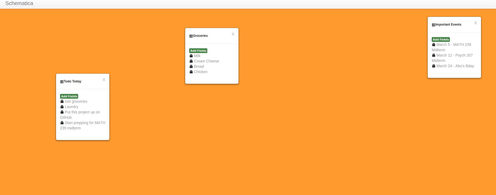

# Schematica
## Description:
This is a schematic planner made with meteor.js. This project was mainly done to help me get more acquainted with the meteor platform and have a cool schematic planner to use.

## Usage
Make sure you have meteor installed. When you have it installed then: 
* Download this project
* cd into the schematica folder and run the command: meteor (open the link it spits out)

* Double-click to insert new tables
* Click icons beside text to modify the text
* You can not delete table items at the moment so you will either have to modify them or delete that table

## Features to come:
* resizeable tables
* deletable & draggable items
* users can set their own backgrounds + more colors for the random backgrounds
